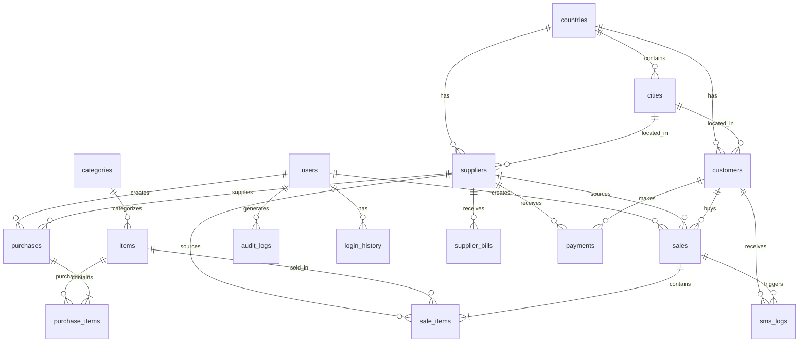

# Database Entity Relationship Diagram

## FishPlus Distributor - Data Model (SQLite)

### Visual Diagram (Mermaid)



### Table Relationships

| Parent Table | Child Table | Relationship | Foreign Key |
|--------------|-------------|--------------|-------------|
| countries | cities | 1:M | country_id |
| countries | suppliers | 1:M | country_id |
| countries | customers | 1:M | country_id |
| cities | suppliers | 1:M | city_id |
| cities | customers | 1:M | city_id |
| categories | items | 1:M | category_id |
| suppliers | purchases | 1:M | supplier_id |
| suppliers | supplier_bills | 1:M | supplier_id |
| suppliers | payments | 1:M | supplier_id |
| suppliers | sales | 1:M | supplier_id |
| customers | sales | 1:M | customer_id |
| customers | payments | 1:M | customer_id |
| sales | sale_items | 1:M | sale_id |
| purchases | purchase_items | 1:M | purchase_id |
| users | sales | 1:M | created_by |
| users | purchases | 1:M | created_by |
| users | audit_logs | 1:M | user_id |
| users | login_history | 1:M | user_id |
| items | sale_items | 1:M | item_id |
| items | purchase_items | 1:M | item_id |

### Core Entities Summary

| Entity | Purpose | Record Count (Est.) |
|--------|---------|---------------------|
| **Supplier** | Fish suppliers/vendors | 50-200 |
| **Customer** | Buyers/clients | 100-500 |
| **Item** | Fish types/products | 20-50 |
| **Sale** | Sale transactions | 10,000+ per year |
| **SaleLineItem** | Sale line details | 30,000+ per year |
| **Purchase** | Purchase transactions | 5,000+ per year |
| **PurchaseLineItem** | Purchase line details | 15,000+ per year |
| **SupplierBill** | Supplier periodic bills | 2,000+ per year |
| **Payment** | Cash receipts/payments | 5,000+ per year |

### Data Flow Diagram

```
┌─────────────┐     ┌─────────────┐     ┌─────────────┐
│  SUPPLIER   │────▶│  PURCHASE   │────▶│    ITEM     │
│             │     │             │     │   (STOCK)   │
└─────────────┘     └─────────────┘     └──────┬──────┘
       │                                        │
       │                                        │
       ▼                                        ▼
┌─────────────┐     ┌─────────────┐     ┌─────────────┐
│ SUPPLIER    │     │    SALE     │◀────│  CUSTOMER   │
│    BILL     │     │             │     │             │
└─────────────┘     └──────┬──────┘     └──────┬──────┘
       │                   │                   │
       │                   ▼                   │
       │            ┌─────────────┐            │
       └───────────▶│   PAYMENT   │◀───────────┘
                    │  (RECEIPT)  │
                    └─────────────┘
```

### Key Business Calculations

| Calculation | Formula | Tables Involved |
|-------------|---------|-----------------|
| **Current Stock** | OpeningStock + ∑Purchases - ∑Sales | Item, PurchaseLineItem, SaleLineItem |
| **Customer Balance** | OpeningBalance + ∑Sales - ∑Receipts | Customer, Sale, Payment |
| **Supplier Balance** | OpeningBalance + ∑Purchases - ∑Payments | Supplier, Purchase, Payment |
| **Sale Net Amount** | GrossAmount + Charges - Discount - Cash | Sale |
| **Supplier Bill** | TotalPurchases - Commission - Charges - Payments | SupplierBill |

### Urdu Field Mapping Reference

| English Field | Urdu Label | Table |
|---------------|------------|-------|
| SupplierName | نام | Supplier |
| CustomerName | نام | Customer |
| ItemName | مال | Item |
| Weight | وزن | SaleLineItem, PurchaseLineItem |
| Rate | ریٹ | SaleLineItem, PurchaseLineItem |
| Amount | رقم | Sale, Purchase |
| GroceryCharges | پرچی | Sale, SupplierBill |
| IceCharges | برف | Sale, SupplierBill |
| LaborCharges | مزدوری | SupplierBill |
| Commission | کمیشن | SupplierBill |
| CashReceived | نقد | Sale |
| Collection | وصولی | Sale, SupplierBill |
| Balance | بقایہ | Sale, SupplierBill |
| Previous | سابقہ | Sale, Purchase |
| Concession | رعایت | Purchase, SupplierBill |
| VehicleNumber | گاڑی نمبر | Sale |
| Date | تاریخ | All transactions |

---

*Generated: 2026-02-06*
*Based on: Requirements.md v1.1*
